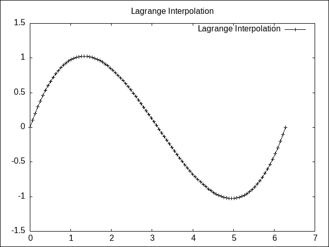

# Lagrange Interpolation

Written in Ubuntu 23.04 LTS. This progam was written for GNU/Linux systems.

## Visualize lagrange polynomials with GNU plot

Implements Langrange-Interpolation in the `C programming language`. Creates complete polynomials from Node Value pairs in csv files, and creates 2 dimensional plots, using `gnuplot`, which are saved as png files.   

## Dependences

1. gcc
2. gnuplot

## Formulation

Lagrange interpolation is a mathematical method that finds new points $(x,y)$ in between known discrete points $(x_k, y_k)$ for $k \in \mathbb{Z}$. These new points are calculated using a polynomial $P_n(x)$ called the *Lagrange Polynomial*. The maximum value for $k$ is $n$, which is the degree of $P_n(x)$. 

The *Lagrange Polynomial* is written in the following form:

$$P_n(x) = y_0L_0(x) + y_1L_1(x) + \dots + y_nL_n(x)$$

Where $L_k(x)$ is called the *Lagrange Basis*, and is written as such

$$L_i(x) = \frac{x - x_0}{x_i - x_0} \dots \frac{x - x_{i-1}}{x_i - x_{i-1}}\frac{x - x_{i+1}}{x_i - x_{i+1}} \dots \frac{x - x_n}{x_i - x_n} $$

For $n$ known points, or node, value pairs, the lagrange basis would be composed of $n$ basis vectors (Lagrange Basis).

## Example
 

This example takes critical points from a **sine wave**. Using Lagrange Interpolation, an approximation of the complete wave can be constucted.

The data in `data/sine.csv` is format as the following

<p align='center'>
<table style="border-collapse: collapse; width: 50%; margin: 20px auto; font-family: Arial, sans-serif;">
    <thead>
        <tr>
            <th style="border: 2.5px solid #6e6e6e; padding: 10px; text-align: center;">Nodes</th>
            <th style="border: 2.5px solid #6e6e6e; padding: 10px; text-align: center;">Values</th>
        </tr>
    </thead>
    <tbody>
        <tr>
            <td style="border: 2.5px solid #6e6e6e; padding: 10px; text-align: center;">0</td>
            <td style="border: 2.5px solid #6e6e6e; padding: 10px; text-align: center;">0</td>
        </tr>
        <tr>
            <td style="border: 2.5px solid #6e6e6e; padding: 10px; text-align: center;">1.5707</td>
            <td style="border: 2.5px solid #6e6e6e; padding: 10px; text-align: center;">1</td>
        </tr>
        <tr>
            <td style="border: 2.5px solid #6e6e6e; padding: 10px; text-align: center;">3.1416</td>
            <td style="border: 2.5px solid #6e6e6e; padding: 10px; text-align: center;">0</td>
        </tr>
        <tr>
            <td style="border: 2.5px solid #6e6e6e; padding: 10px; text-align: center;">4.7124</td>
            <td style="border: 2.5px solid #6e6e6e; padding: 10px; text-align: center;">-1</td>
        </tr>
        <tr>
            <td style="border: 2.5px solid #6e6e6e; padding: 10px; text-align: center;">6.2832</td>
            <td style="border: 2.5px solid #6e6e6e; padding: 10px; text-align: center;">0</td>
        </tr>
    </tbody>
</table>

</p>

The program can be executed by the following

```
./run.sh [csv_file]
```

For this example `csv_file` would be `sine.csv`. If the program ran successfully the following message would appear:

```
Data read successfully
Nodes:  Values:
0.00    0.00
1.57    1.00
3.14    0.00
4.71    -1.00
6.28    0.00
Initializing Lagrange Interpolation
Creating plot
Plot saved as 'img/sine.png'
```

And the following image is saved to `img` as a `png` file type.
<p align="center">
  
</p>


## License

MIT License - see LICENSE for details.